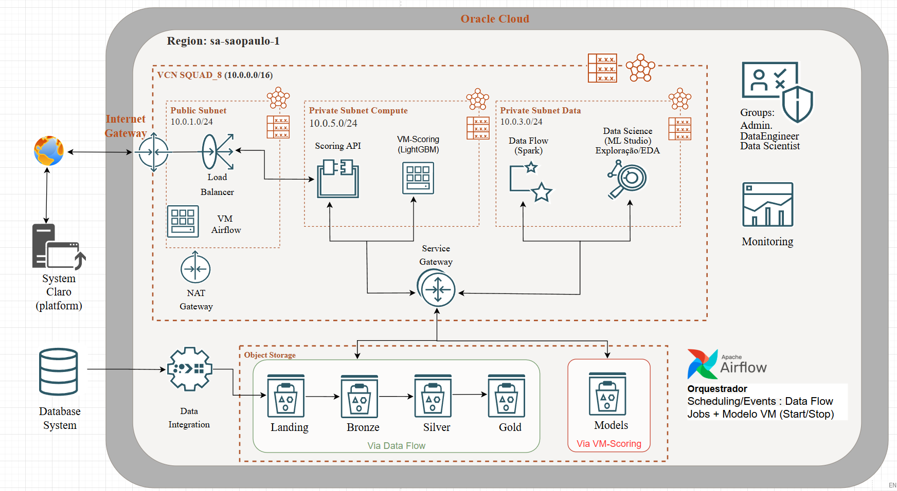

# Migração OCI - Hackathon PodAcademy 2025



Migração do projeto de Databricks para Oracle Cloud Infrastructure (OCI) usando Terraform, OCI Data Flow (Spark gerenciado), Airflow (orquestração) e VM dedicada para scoring LightGBM.

## Status das Fases

| Fase | Status | Recursos |
|------|--------|----------|
| **Fase 0** | ✅ Concluída | Setup: Provider OCI v5.47.0, backend local, credenciais validadas |
| **Fase 1** | ✅ Aplicada | IAM: 6 compartments, 3 grupos, 4 políticas de acesso |
| **Fase 2** | ✅ Aplicada | Network: VCN, 3 subnets, 3 gateways, 2 route tables, 2 security lists |
| **Fase 3** | ✅ Re-aplicada | Storage: 7 buckets (landing, bronze, silver, gold, models, tfstate, pipeline-ops) |
| **Fase 4** | ✅ Re-aplicada | Compute: 21 Data Flow Applications com per-app shapes (6 famílias para paralelismo) |
| **Fase 5** | ✅ Concluída | Airflow: VM E3.Flex + Docker Compose + Dynamic Group + Instance Principal |
| **Fase 6A** | ✅ Concluída | Landing → Bronze: 6 scripts adaptados, testados e executados no Data Flow |
| **Fase 6B** | ✅ Concluída | Silver (6 scripts) + Gold Features (3 scripts) + ABT v1-v6: pipeline completo |
| **Fase 7** | ✅ Concluída | Data Science: Notebook na private-data-subnet, Dynamic Groups granulares por papel |
| **Fase 8** | ✅ Concluída | Modelo Scoring: VM E5.Flex 2 OCPUs/32 GB, DAG Start/Stop via Airflow, KS OOT=34.26% |

---

## Quick Start

### 1. Configurar Credenciais OCI

```bash
cd mig_oci/terraform/environments/prod
cp terraform.tfvars.example terraform.tfvars
# Editar terraform.tfvars com suas credenciais OCI
```

### 2. Inicializar e Aplicar

```bash
# Executar LOCAL:
cd mig_oci/terraform/scripts
./init.sh              # Validar credenciais + inicializar
./apply_phase.sh 1     # Aplicar fase específica
```

### 3. Upload de Scripts

```bash
# Executar LOCAL:
cd mig_oci/data_upload
./upload_scripts.sh    # Envia 21 scripts + utils.zip para o bucket pipeline-ops
```

### 4. Deploy do Airflow

```bash
# Executar LOCAL:
cd mig_oci/airflow
./deploy_to_vm.sh <AIRFLOW_VM_IP> ~/.ssh/airflow_vm
```

### 5. Deploy do Modelo

```bash
# Executar LOCAL:
cd mig_oci/airflow
./deploy_modelo.sh <AIRFLOW_IP> <MODELO_IP> ~/.ssh/airflow_vm ~/.ssh/modelo_vm
```

> **Nota:** O Airflow VM precisa estar RUNNING para deploy. O Modelo VM precisa estar STOPPED antes de triggar a DAG.

---

## Estrutura do Projeto

```
mig_oci/
├── terraform/
│   ├── modules/
│   │   ├── iam/          # Compartments, grupos, políticas
│   │   ├── network/      # VCN, subnets, gateways, security lists
│   │   ├── storage/      # 7 buckets Object Storage
│   │   ├── compute/      # 21 Data Flow Applications (for_each dinâmico)
│   │   ├── airflow/      # VM E3.Flex + Dynamic Group + Instance Principal + lifecycle
│   │   └── modelo_vm/    # VM E5.Flex 2 OCPUs/32 GB + Dynamic Group + Instance Principal + lifecycle
│   ├── environments/prod/
│   │   ├── main.tf, variables.tf, outputs.tf
│   │   └── terraform.tfvars.example
│   └── scripts/
│       ├── init.sh              # Inicializar + validar credenciais
│       └── apply_phase.sh       # Aplicar fase específica (1-5)
├── data_upload/
│   ├── scripts/                 # 21 scripts PySpark (versão principal)
│   │   ├── bronze_*.py          # 6 scripts Bronze (Landing → Bronze)
│   │   ├── silver_*.py          # 6 scripts Silver opt_z (sem cache, coalesce dinâmico)
│   │   ├── gold_*.py            # 3 scripts Gold (Silver → Gold features)
│   │   ├── abt_*.py             # 6 scripts ABT (Gold → ABT v1-v6, v6 com VACUUM)
│   │   └── opc_standby/         # Versões alternativas por script
│   └── upload_scripts.sh        # Upload scripts para bucket pipeline-ops
├── airflow/                     # Orquestração Airflow (Docker Compose)
│   ├── deploy_to_vm.sh          # Deploy automatizado (local → VM Airflow)
│   ├── deploy_modelo.sh         # Deploy script scoring (local → VM Modelo via jump host)
│   ├── dags/
│   │   ├── dag_pipeline_fpd.py             # DAG ETL v3.0.0: 21 apps + TriggerDagRunOperator → modelo
│   │   ├── dag_modelo_qualificacao.py      # DAG modelo v2.1.0: Start → SSH scoring → Stop
│   │   └── dag_pipeline_fpd_sequential.py  # DAG sequencial (teste com quota limitada)
│   ├── config/                  # Variables JSON + populate_variables.sh
│   └── docker/                  # docker-compose.yml + setup_vm.sh
├── data_science/
│   └── scripts/
│       └── modelo_qualificacao.py  # Script scoring: pandas + LightGBM, Instance Principal
└── docs/                        # Documentação por fase
    ├── FASE_0_1_IMPLEMENTACAO.md
    ├── FASE_2_3_IMPLEMENTACAO.md
    ├── FASE_4_IMPLEMENTACAO.md
    ├── FASE_6A_LANDING_BRONZE.md
    ├── FASE_6A_TROUBLESHOOTING.md
    ├── FASE_6B_SILVER.md
    ├── FASE_6B_GOLD_FEATURES.md
    ├── FASE_7_DATA_SCIENCE_NOTEBOOK.md
    ├── FASE_8_MODELO_VM_IMPLEMENTACAO.md
    ├── FASE_8_TROUBLESHOOTING.md
    ├── MODELO_ARTEFATOS_GUIDE.md
    └── IAM_USUARIOS_EQUIPE.md
```

---

## Arquitetura do Pipeline

### Pipeline ETL (21 Data Flow Applications)

```
Landing Zone (OCI Object Storage)
    │
    ├── bronze_bureau.py    ─┐
    ├── bronze_telco.py      │
    ├── bronze_cadastro.py   ├─ Bronze Layer (6 apps) ✅
    ├── bronze_recarga.py    │
    ├── bronze_pagamento.py  │
    └── bronze_atraso.py    ─┘
           │
    ├── silver_bureau.py    ─┐
    ├── silver_telco.py      │
    ├── silver_cadastro.py   ├─ Silver Layer (6 apps) ✅
    ├── silver_recarga.py    │
    ├── silver_pagamento.py  │
    └── silver_atraso.py    ─┘
           │
    ├── gold_recarga.py     ─┐
    ├── gold_pagamento.py    ├─ Gold Features (3 apps) ✅
    └── gold_atraso.py      ─┘
           │
    ├── abt_v1_builder.py   ─┐
    ├── abt_v2_builder.py    │
    ├── abt_v3_builder.py    ├─ ABT Builders (6 apps) ✅
    ├── abt_v4_builder.py    │  (v6 inclui VACUUM para limpar parquets órfãos)
    ├── abt_v5_builder.py    │
    └── abt_v6_builder.py   ─┘
           │
    TriggerDagRunOperator ──── DAG Modelo Qualificação
                                  │
                           VM Start → SSH scoring → VM Stop
                                  │
                           KS OOT = 34.26% (+1.16 p.p. acima do benchmark)
```

### Encadeamento ETL → Modelo

```
DAG pipeline_fpd (ETL)                    DAG pipeline_modelo_qualificacao
┌─────────────────────────┐               ┌──────────────────────────────┐
│ Bronze → Silver → Gold  │               │ start_vm                     │
│ → ABT v1-v6             │──trigger──→   │ → wait_vm_ready              │
│                         │               │ → run_modelo (SSH + scoring) │
└─────────────────────────┘               │ → stop_vm (trigger=ALL_DONE) │
                                          └──────────────────────────────┘
```

**Por que DAGs separadas?**
1. Logs e retries independentes
2. Re-scoring sem re-ETL (trigger manual)
3. SLAs e alertas diferentes
4. Facilita debugging (isolar ETL vs Modelo)
5. Custo: VM Modelo só liga quando necessário

---

## Modelo de Scoring

| Métrica | Valor |
|---------|-------|
| **KS OOT** | 34.26% |
| **Benchmark** | 33.10% |
| **Gap** | +1.16 p.p. |
| **Features** | 261 (IV >= 0.01) |
| **VM** | E5.Flex, 2 OCPUs, 32 GB RAM |
| **Runtime** | pandas + LightGBM (~5 min) |
| **Padrão** | Start/Stop via Airflow (custo zero quando inativo) |

### Artefatos no Bucket `hackathon-2025-models`

```
hackathon-2025-models/
├── pkl/                    # Modelo treinado (modelo_fpd.pkl)
├── resultados_modelo/      # Predições OOT por execução (parquet)
└── metricas/               # KS, AUC, GINI por execução (JSON + features TXT)
```

> Guia completo: `docs/MODELO_ARTEFATOS_GUIDE.md`

---

## Delta Lake: VACUUM e Parquets Órfãos

O pipeline ABT escreve em formato **Delta Lake** com `.mode("overwrite")`. O overwrite é **lógico** (atualiza `_delta_log`) mas **não deleta fisicamente** os parquets antigos. O script do modelo (pandas) lê via `list_objects` que ignora o `_delta_log`, carregando dados duplicados.

**Soluções implementadas (defesa em profundidade):**

| Camada | Onde | O que faz |
|--------|------|-----------|
| **VACUUM** | `abt_v6_builder.py` | Remove parquets órfãos após cada execução do pipeline |
| **Dedup incremental** | `modelo_qualificacao.py` | Safety net: dedup a cada 40 arquivos durante leitura |

> Documentação completa: `docs/FASE_8_TROUBLESHOOTING.md` (Problema 13)

---

## IAM — Equipe e Acessos

**Grupos criados (Fase 1):**

| Grupo | Acesso Principal |
|-------|-----------------|
| `hackathon-2025-administrators` | Acesso total ao projeto |
| `hackathon-2025-data-engineers` | Object Storage (manage) + Data Flow (manage) |
| `hackathon-2025-data-scientists` | Data Science Notebooks + leitura buckets |

**Dynamic Groups (Instance Principal):**

| Dynamic Group | VM | Permissões |
|--------------|-----|-----------|
| `hackathon-2025-airflow-dynamic-group` | Airflow VM | manage dataflow-family + object-family + read virtual-network-family |
| `hackathon-2025-modelo-scoring-dynamic-group` | Modelo VM | manage object-family + read virtual-network-family |

> Detalhes: `docs/IAM_USUARIOS_EQUIPE.md`

---

## Divisão de Responsabilidades

| Ferramenta | O que faz | Quando |
|------------|-----------|--------|
| **Terraform** | Cria infraestrutura OCI (compartments, VCN, buckets, VMs, Data Flow apps) | Fases 0-5 |
| **upload_scripts.sh** | Envia scripts Python para o bucket **pipeline-ops** | Antes de cada deploy |
| **OCI Data Flow** | Executa jobs Spark gerenciados (Bronze/Silver/Gold/ABT) | Pipeline ETL |
| **Airflow** | Orquestra execução dos Data Flow jobs + trigger do modelo | Produção |
| **VM Modelo** | Executa scoring LightGBM (pandas, sem Spark) | Após ETL completo |
| **deploy_to_vm.sh** | Deploy do Airflow (Docker Compose + DAGs) | Setup inicial |
| **deploy_modelo.sh** | Deploy do script scoring (via jump host) | Após alterações no modelo |
| **Console OCI** | Testes manuais, monitoramento de runs, gestão de usuários | Durante toda migração |

---

## Lições Aprendidas (principais)

| Problema | Solução |
|----------|---------|
| `FILE_URL_INVALID` no Terraform | Scripts devem existir no bucket **antes** do `terraform apply` |
| `archive_uri` com ZIP simples falha | Exige `conda pack` — usar scripts self-contained no lugar |
| `addPyFile("oci://...")` não funciona | Race condition com Resource Principal — funções inline |
| `spark.hadoop.fs.oci.*` é reservada | Data Flow configura internamente — não incluir no Terraform |
| Delta `mode("overwrite")` acumula ghost files | `VACUUM(retentionHours=0)` após cada overwrite no ABT v6 |
| Modelo OOM com dados duplicados | Dedup incremental a cada 40 arquivos + VACUUM na origem |
| Terraform kmsKeyId ao redimensionar VM | `lifecycle { ignore_changes = [source_details] }` em VMs com imagem dinâmica |
| CRLF em scripts editados no Windows/WSL | `sed -i 's/\r$//'` antes de deploy. `.gitattributes` com `*.py text eol=lf` |
| SSH key path container vs host | Docker mapeia `/opt/airflow-fpd/` → `/opt/airflow/`. Usar path do container |
| Spark HDFS auth em notebook Data Science | Não funciona (IMDS indisponível). Usar OCI SDK (pandas) com Resource Principal |

> Documentação detalhada: `docs/FASE_6A_TROUBLESHOOTING.md`, `docs/FASE_8_TROUBLESHOOTING.md`

---

## Custos Estimados (30 dias desenvolvimento)

| Serviço | Custo |
|---------|-------|
| Storage (295 GB) | $29 |
| Data Flow (3 runs completos) | $715 |
| Data Science Notebooks | $34 |
| Network | $54 |
| Airflow (self-hosted VM) | $183 |
| **Total desenvolvimento** | **~$1,015** |
| **Operacional mensal (pós-hackathon)** | **~$350** |

---

## Troubleshooting Rápido

### Erro: `FILE_URL_INVALID` no Terraform
```bash
# Executar LOCAL:
cd mig_oci/data_upload
./upload_scripts.sh   # Fazer upload dos scripts ANTES do terraform apply
```

### Erro: Quota insuficiente (E4/E3 = 0 no free tier)
> DAG sequencial (`dag_pipeline_fpd_sequential.py`) roda 1 app por vez para evitar conflito de quota.

### Erro: VM Modelo STOPPED durante deploy
```bash
# Executar LOCAL — ligar VM antes do deploy:
oci compute instance action --action START --instance-id <MODELO_VM_OCID>
# Aguardar RUNNING + 30s, depois:
cd mig_oci/airflow && ./deploy_modelo.sh ...
# Após deploy, desligar:
oci compute instance action --action STOP --instance-id <MODELO_VM_OCID>
```

### Erro: OOM no modelo (exit code 255)
> Verificar quantos arquivos .parquet existem no bucket `abt_v6_v2/`. Se > 40, há órfãos do Delta. O VACUUM no próximo pipeline ETL resolve. O dedup incremental no modelo é safety net.

### Warning de permissões da chave `.pem` no WSL
> Inofensivo no WSL/NTFS. Exportar `OCI_CLI_SUPPRESS_FILE_PERMISSIONS_WARNING=True` para silenciar.

---

## Documentação

| Documento | Conteúdo |
|-----------|----------|
| `docs/FASE_0_1_IMPLEMENTACAO.md` | Setup, IAM, conceitos OCI (compartments, groups, policies) |
| `docs/FASE_2_3_IMPLEMENTACAO.md` | Network (VCN, subnets), Storage (buckets), lições aprendidas |
| `docs/FASE_4_IMPLEMENTACAO.md` | Compute (Data Flow applications), upload de scripts |
| `docs/FASE_6A_LANDING_BRONZE.md` | Pipeline Landing → Bronze — as-built, funcionando |
| `docs/FASE_6A_TROUBLESHOOTING.md` | Problemas encontrados e soluções definitivas (pipeline) |
| `docs/FASE_6B_SILVER.md` | Silver Layer: 6 scripts, estratégia dedup, calibração BYTES |
| `docs/FASE_6B_GOLD_FEATURES.md` | Gold Features: 3 scripts, 2 actions, quality gates |
| `docs/FASE_7_DATA_SCIENCE_NOTEBOOK.md` | Data Science notebook, IAM granular, lições |
| `docs/FASE_8_MODELO_VM_IMPLEMENTACAO.md` | Modelo scoring em VM dedicada — as-built |
| `docs/FASE_8_TROUBLESHOOTING.md` | 13 problemas documentados: OOM, SSH, Delta, VACUUM, deploy |
| `docs/MODELO_ARTEFATOS_GUIDE.md` | Guia artefatos modelo (pkl, predições, métricas, retreino, OOT) |
| `docs/IAM_USUARIOS_EQUIPE.md` | Grupos, acessos, integrantes e matriz de permissões |
| `airflow/README.md` | Guia Airflow: deploy, Docker Compose, encadeamento ETL→Modelo |

---

## Referências

- **CLAUDE.md:** `.claude/CLAUDE.md` (quick reference geral do projeto)
- **Guia OCI para o time:** `docs/architecture/GUIA_ARQUITETURA_OCI.md`
- **Arquitetura completa:** `docs/architecture/OCI_ARCHITECTURE.md`
- **Diagrama final:** `docs/architecture/diagrams/11.png`
