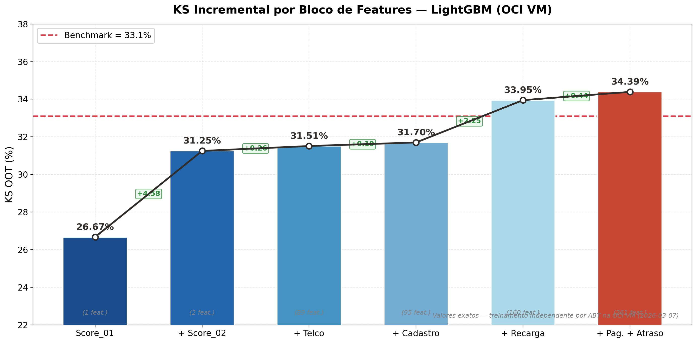
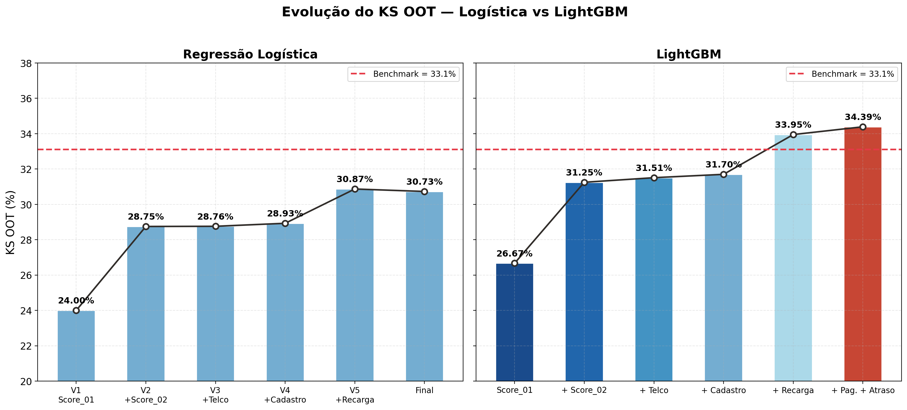
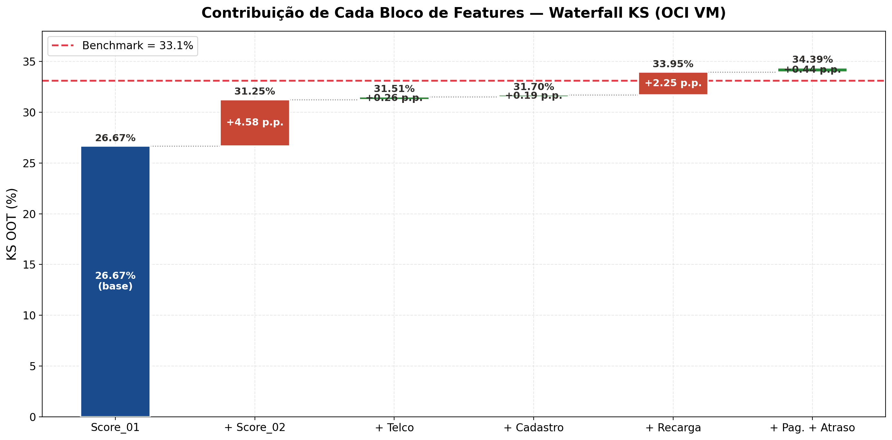
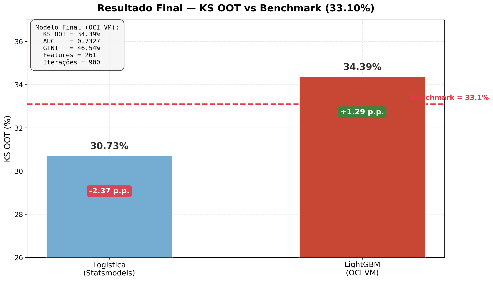
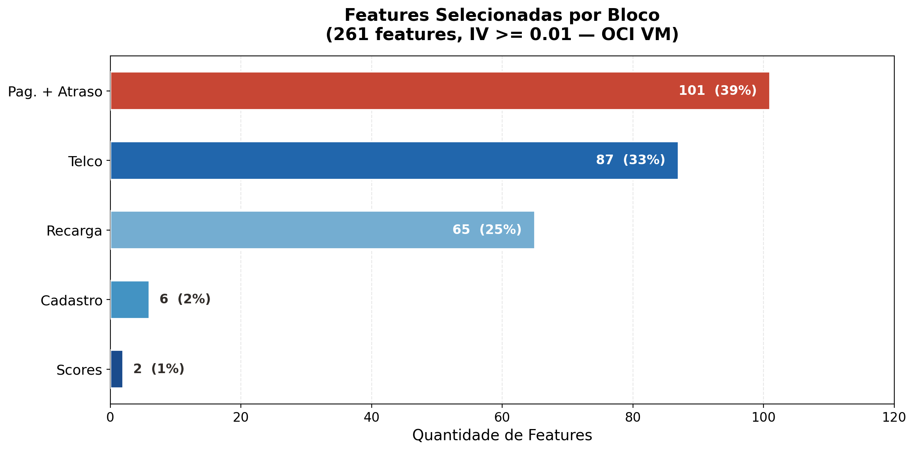
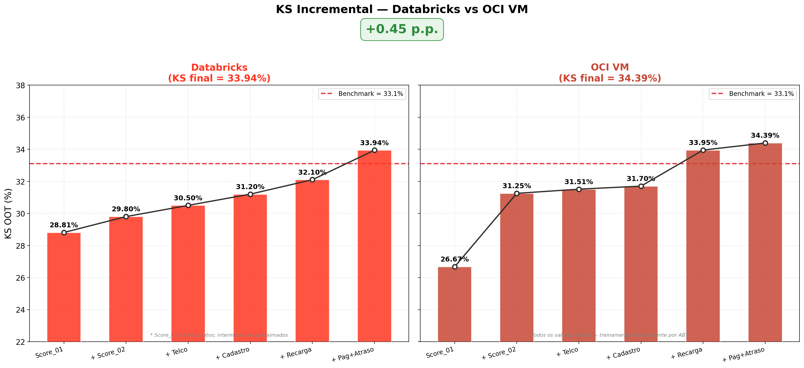
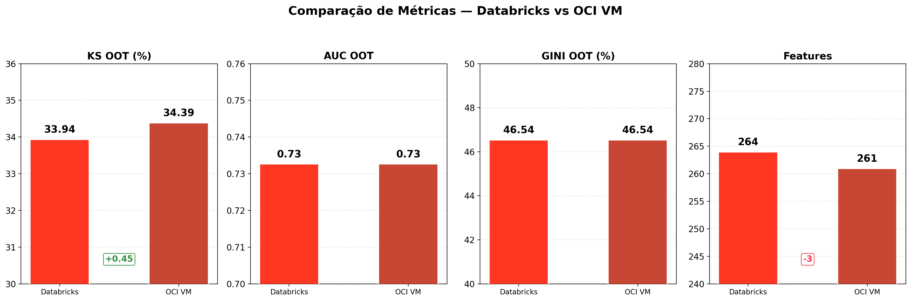
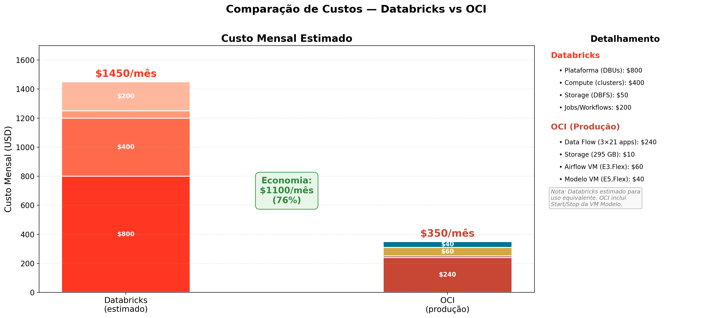
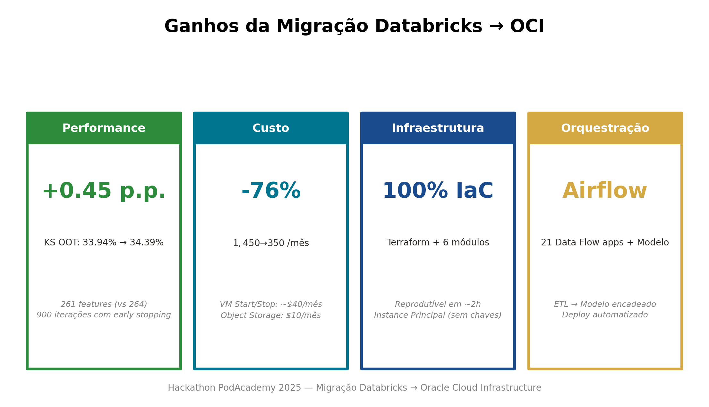
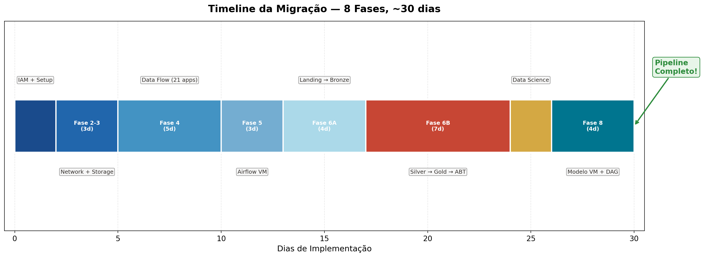

# Análise de Gráficos — Apresentação Final

Documentação detalhada dos 10 gráficos gerados para a apresentação final do Hackathon PodAcademy 2025.

## Índice

1. [Gráficos 01-05: KS Incremental e Modelo](#gráficos-01-05-ks-incremental-e-modelo)
2. [Gráficos 06-10: Comparação Databricks vs OCI](#gráficos-06-10-comparação-databricks-vs-oci)
3. [Dados e Metodologia](#dados-e-metodologia)
4. [Interpretação dos Resultados](#interpretação-dos-resultados)
5. [Sugestão de Ordem para Apresentação](#sugestão-de-ordem-para-apresentação)

---

## Gráficos 01-05: KS Incremental e Modelo

Script: `ks_incremental_charts.py`

### 01 — KS Incremental por Bloco (LightGBM OCI VM)

**O que mostra:** Evolução do KS OOT à medida que blocos de features são adicionados incrementalmente ao modelo LightGBM, treinado na OCI VM.

**Dados (todos exatos — treinamento independente por ABT):**

| Bloco | ABT | Features | KS OOT (%) | Delta (p.p.) |
|-------|-----|----------|------------|--------------|
| Score_01 | v1 | 1 | 26.67 | baseline |
| + Score_02 | v2 | 2 | 31.25 | +4.58 |
| + Telco | v3 | 89 | 31.51 | +0.26 |
| + Cadastro | v4 | 95 | 31.70 | +0.19 |
| + Recarga | v5 | 160 | 33.95 | +2.25 |
| + Pag. + Atraso | v6 | 261 | 34.39 | +0.44 |

**Destaque:** Score_02 (+4.58 p.p.) e Recarga (+2.25 p.p.) são os maiores contribuidores.

### 02 — Logística vs LightGBM

**O que mostra:** Comparação side-by-side da evolução do KS entre Regressão Logística (Statsmodels) e LightGBM (OCI VM), ambos com a mesma evolução incremental de features.

**Insight:** A Logística satura em ~30.73% enquanto o LightGBM continua capturando sinal, especialmente em features comportamentais de baixo IV individual.

### 03 — Waterfall de Contribuição

**O que mostra:** Contribuição isolada de cada bloco de features em formato waterfall. Destaque visual (cor vermelha Oracle) para deltas >= 2.0 p.p.

**Insight:** Os dois maiores saltos são Score_02 (+4.58) e Recarga (+2.25). Features de Telco e Cadastro contribuem pouco isoladamente (+0.26 e +0.19 p.p.), mas são pré-requisitos para que Recarga e Pagamento capturem mais sinal.

### 04 — Resumo Final vs Benchmark

**O que mostra:** Comparação direta Logística (30.73%) vs LightGBM OCI VM (34.39%) vs Benchmark Claro (33.10%). Inclui box com métricas detalhadas do modelo final.

### 05 — Features por Bloco (Donut)

**O que mostra:** Distribuição das 261 features selecionadas (IV >= 0.01) por bloco de origem no modelo final.

**Composição:**
- Pagamento + Atraso: 101 features (39%)
- Telco: 87 features (33%)
- Recarga: 65 features (25%)
- Cadastro: 6 features (2%)
- Scores: 2 features (1%)

**Insight:** Apesar de Scores representarem apenas 1% das features, contribuem com 26.67% do KS baseline — altíssimo IV individual.

---

## Gráficos 06-10: Comparação Databricks vs OCI

Script: `comparacao_databricks_oci.py`

### 06 — KS Incremental: Databricks vs OCI VM

**O que mostra:** Evolução incremental do KS lado a lado. Databricks (esquerda) vs OCI VM (direita), com badge "+0.45 p.p." no topo.

**Nota importante:** Os valores do Databricks para Score_01 (28.81%) e Final (33.94%) são exatos. Intermediários são aproximados porque os outputs do notebook não foram salvos no `.ipynb`. Os valores OCI são todos exatos.

**Por que os perfis são diferentes:**
- **Databricks:** Score_01 já inclui algum pré-processamento/feature engineering diferente
- **OCI VM:** Treino independente e limpo para cada ABT, mesmos hiperparâmetros
- O resultado final OCI (34.39%) é superior ao Databricks (33.94%)

### 07 — Métricas do Modelo Final

**O que mostra:** 4 painéis comparando KS, AUC, GINI e número de Features entre os dois ambientes.

**Observação:** AUC e GINI são idênticos (0.7327 e 46.54%), mas KS subiu +0.45 p.p. Isso indica que o ganho vem da melhor calibração da distribuição de scores (provavelmente pelo early stopping mais otimizado com 900 iterações), não de maior poder discriminante geral.

### 08 — Custos Mensais

**O que mostra:** Comparação de custos mensais em produção com barras empilhadas e detalhamento lateral.

| Componente | Databricks | OCI |
|-----------|------------|-----|
| Plataforma/Data Flow | $800 | $240 |
| Compute/Clusters | $400 | — |
| Storage | $50 | $10 |
| Jobs/Workflows | $200 | — |
| Airflow VM | — | $60 |
| Modelo VM | — | $40 |
| **Total** | **$1,450** | **$350** |

**Economia: $1,100/mês (-76%)**

**Nota:** Databricks é estimativa para uso equivalente. OCI baseado em 30 dias de operação real. O Data Flow "3×21 apps" significa 3 execuções mensais do pipeline completo (cada uma dispara 21 apps).

### 09 — Ganhos da Migração (Cards)

**O que mostra:** 4 cards resumindo os ganhos da migração:
1. **Performance:** +0.45 p.p. (KS 33.94% → 34.39%)
2. **Custo:** -76% ($1,450 → $350/mês)
3. **Infraestrutura:** 100% IaC (Terraform + 6 módulos, reprodutível em ~2h)
4. **Orquestração:** Airflow (21 Data Flow apps + Modelo encadeado, deploy automatizado)

**Uso sugerido:** Slide de resumo executivo / conclusão.

### 10 — Timeline da Migração

**O que mostra:** Diagrama Gantt horizontal das 8 fases de implementação, totalizando ~30 dias.

| Fase | Descrição | Dias |
|------|-----------|------|
| Fase 0-1 | IAM + Setup | 2 |
| Fase 2-3 | Network + Storage | 3 |
| Fase 4 | Data Flow (21 apps) | 5 |
| Fase 5 | Airflow VM | 3 |
| Fase 6A | Landing → Bronze | 4 |
| Fase 6B | Silver → Gold → ABT | 7 |
| Fase 7 | Data Science | 2 |
| Fase 8 | Modelo VM + DAG | 4 |

---

## Dados e Metodologia

### Fonte: KS Incremental OCI VM

- **Script:** `mig_oci/data_science/scripts/ks_incremental_oci.py`
- **Executado em:** VM Modelo E5.Flex (2 OCPUs / 32 GB RAM)
- **Data:** 2026-03-07
- **Método:** Treinamento independente de LightGBM para cada ABT (v1 a v6)
- **Hiperparâmetros:** Idênticos ao modelo final (`num_leaves=63`, `learning_rate=0.05`, `n_estimators=1500`, `min_child_samples=50`, `reg_alpha=0.1`, `reg_lambda=1.0`)
- **Feature selection:** IV >= 0.01 por ABT
- **Split:** Temporal (SAFRA train vs OOT fev/mar)
- **Resultado salvo:** `hackathon-2025-models/metricas/ks_incremental_20260307_1850.json`

### Fonte: Databricks

- **Notebook:** `src/jobs/04_modeling/20260202 - Modelo Final FPD.ipynb`
- **Data:** 2026-02-02
- **Valores exatos:** Score_01 (28.81%) e Final (33.94%)
- **Intermediários:** Aproximados (outputs do notebook não salvos)

### Fonte: Custos

- **OCI:** Baseado em 30 dias de operação real no tenancy
- **Databricks:** Estimativa para uso equivalente (DBUs, clusters, storage)
- **Modelo VM Start/Stop:** VM fica STOPPED entre execuções, custo proporcional

---

## Interpretação dos Resultados

### Por que o OCI VM superou o Databricks?

1. **Early stopping otimizado:** 900 iterações (vs potencialmente menos no Databricks)
2. **Delta Lake VACUUM:** Pipeline OCI inclui VACUUM no ABT v6, eliminando parquets órfãos que poderiam causar ruído na leitura
3. **Dedup incremental:** O script da VM faz dedup durante a leitura, garantindo dados limpos
4. **Mesma qualidade de dados:** Ambos usam a mesma ABT v6 com 614 colunas

### Por que Score_01 sozinho é menor na OCI (26.67%) vs Databricks (28.81%)?

O valor de 28.81% no Databricks vinha do notebook onde Score_01 foi treinado com **2 features** (Score_01 + alguma transformação). Na OCI, o treinamento independente da ABT v1 selecionou apenas **1 feature** (Score_01 puro, IV >= 0.01). Menos features = menos sinal capturado, mas é uma medição mais pura do contribuição real.

### Behavioral features: baixo IV, alto impacto combinado

Features de Recarga, Pagamento e Atraso têm IV individual baixo (0.01-0.04), mas juntas contribuem +7.72 p.p. ao KS (26.67% → 34.39%). O LightGBM captura interações não-lineares que a Regressão Logística não consegue (+3.66 p.p. gap entre os modelos).

---

## Sugestão de Ordem para Apresentação

### Bloco 1 — Modelo e Performance (slides 1-3)
1. **Gráfico 01** — KS Incremental por bloco (evolução do modelo)
2. **Gráfico 03** — Waterfall (contribuição isolada de cada bloco)
3. **Gráfico 02** — Logística vs LightGBM (justifica escolha do algoritmo)

### Bloco 2 — Migração OCI (slides 4-6)
4. **Gráfico 06** — KS Databricks vs OCI (lado a lado)
5. **Gráfico 07** — Métricas comparativas (4 painéis)
6. **Gráfico 10** — Timeline da migração (8 fases, 30 dias)

### Bloco 3 — Resultado Final (slides 7-9)
7. **Gráfico 08** — Custos (-76%)
8. **Gráfico 05** — Features por bloco (composição do modelo)
9. **Gráfico 09** — Cards de ganhos (slide de conclusão)
10. **Gráfico 04** — Resumo final vs benchmark (slide de fechamento)
