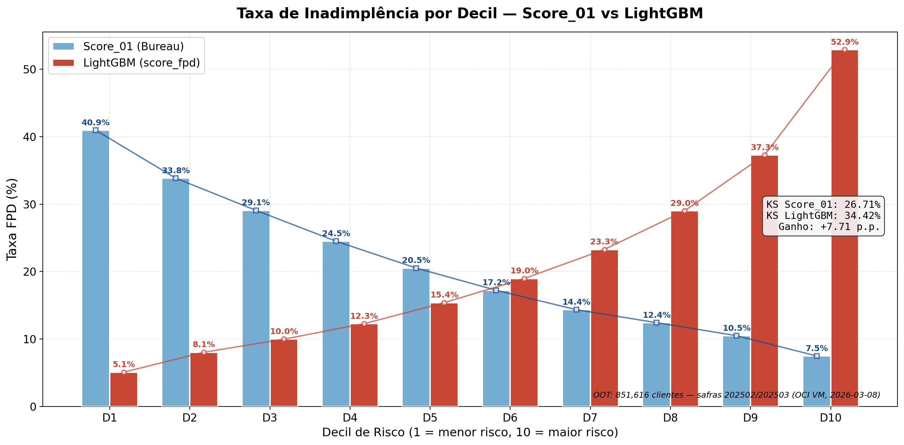
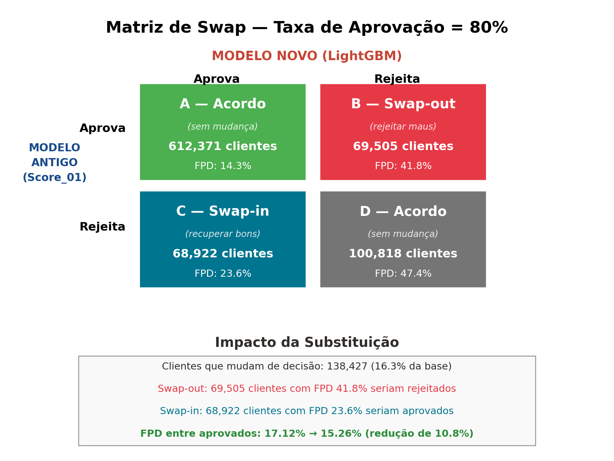
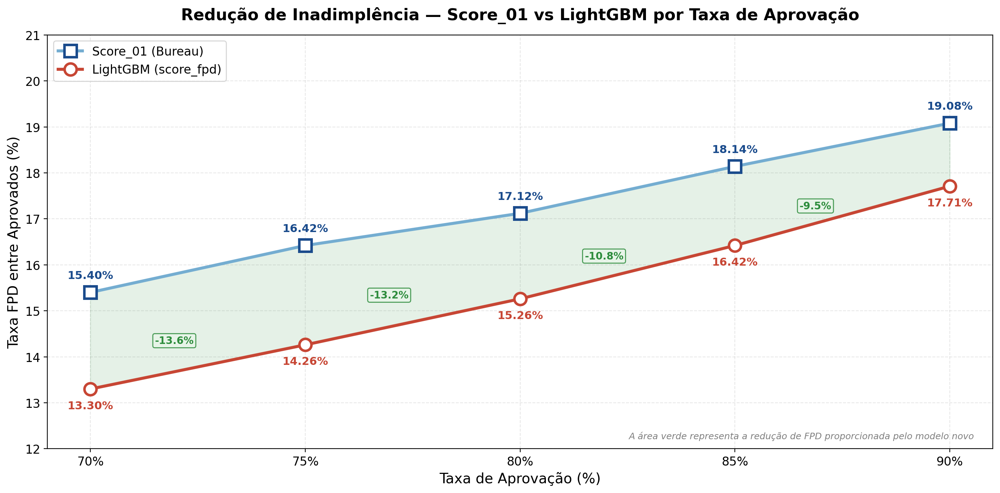
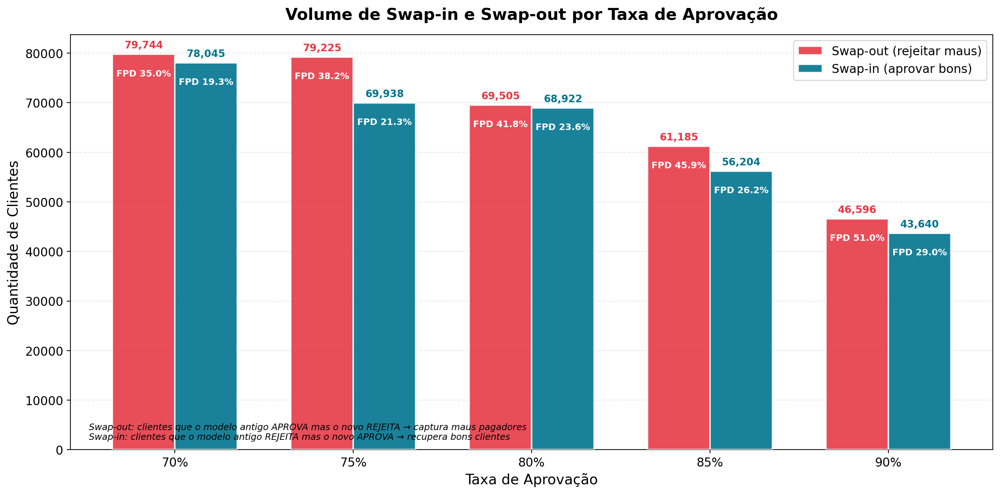
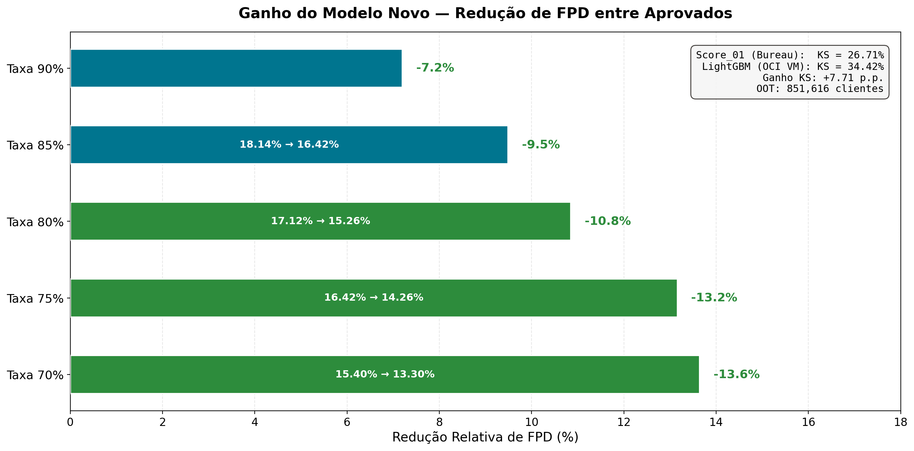

# Análise Swap-in / Swap-out — Apresentação Final

Documentação detalhada dos 5 gráficos gerados para a análise de impacto prático da substituição do modelo de crédito.

## Índice

1. [Conceito de Swap-in / Swap-out](#conceito-de-swap-in--swap-out)
2. [Gráficos 11-15: Análise de Swap](#gráficos-11-15-análise-de-swap)
3. [Dados e Metodologia](#dados-e-metodologia)
4. [Interpretação dos Resultados](#interpretação-dos-resultados)
5. [Sugestão de Ordem para Apresentação](#sugestão-de-ordem-para-apresentação)

---

## Conceito de Swap-in / Swap-out

A análise de swap responde à pergunta: **"Se substituirmos o modelo atual pelo novo, o que muda na prática?"**

Para uma mesma taxa de aprovação (ex: 80%), os dois modelos podem discordar sobre quais clientes aprovar ou rejeitar. Essa discordância gera a matriz de swap:

```
                          MODELO NOVO (LightGBM)
                       Aprova         Rejeita
                   ┌──────────────┬──────────────┐
MODELO      Aprova │  A — Acordo  │ B — Swap-out │
ANTIGO             │ (sem mudança)│ (rejeitar     │
(Score_01)         │              │  maus pagadores)
                   ├──────────────┼──────────────┤
            Rejeita│ C — Swap-in  │  D — Acordo  │
                   │ (recuperar   │ (sem mudança) │
                   │  bons clientes)              │
                   └──────────────┴──────────────┘
```

- **Swap-out (B):** Modelo antigo APROVARIA, novo REJEITA → captura maus pagadores
- **Swap-in (C):** Modelo antigo REJEITARIA, novo APROVA → recupera bons clientes

**O valor de negócio está na qualidade de quem troca:** se o Swap-out tem FPD muito alta e o Swap-in tem FPD menor, a substituição melhora a carteira.

---

## Gráficos 11-15: Análise de Swap

Script: `swap_charts.py`

### 11 — Taxa FPD por Decil: Score_01 vs LightGBM



**O que mostra:** Comparação da capacidade de ordenação (ranking power) dos dois modelos. Cada barra representa a taxa de inadimplência dentro de um decil de risco.

**Dados:**

| Decil | FPD Score_01 (%) | FPD LightGBM (%) | Score_01 Range |
|-------|-----------------|-------------------|----------------|
| D1 (menor risco) | 40.94 | 5.11 | 2 – 531 |
| D2 | 33.83 | 8.06 | 532 – 553 |
| D3 | 29.07 | 10.00 | 554 – 569 |
| D4 | 24.50 | 12.29 | 570 – 582 |
| D5 | 20.53 | 15.40 | 583 – 595 |
| D6 | 17.23 | 18.98 | 596 – 607 |
| D7 | 14.36 | 23.28 | 608 – 619 |
| D8 | 12.44 | 28.99 | 620 – 636 |
| D9 | 10.51 | 37.27 | 637 – 656 |
| D10 (maior risco) | 7.51 | 52.86 | 657 – 771 |

**Destaques:**
- O LightGBM separa **10x** entre D1 e D10 (5.1% vs 52.9%)
- O Score_01 separa apenas **5x** (7.5% vs 40.9%)
- A razão de odds entre extremos é muito mais acentuada no LightGBM

**Nota sobre ordenação:** O Score_01 (bureau) tem lógica invertida — score ALTO = cliente BOM. Por isso D1 (menor risco pelo LightGBM) corresponde a D10 (maior score pelo Score_01). Os decis do Score_01 aparecem na ordem inversa no gráfico para manter D1 = menor risco em ambos os modelos.

### 12 — Matriz de Swap (Taxa de Aprovação = 80%)



**O que mostra:** Matriz 2×2 para a taxa de aprovação de 80%, com volume de clientes e taxa FPD em cada célula.

**Dados (taxa de aprovação = 80%):**

| Célula | Descrição | Clientes | FPD |
|--------|-----------|----------|-----|
| A — Acordo (aprovam) | Ambos aprovam | 612,371 | 14.3% |
| B — Swap-out | Antigo aprova, novo rejeita | 69,505 | 41.8% |
| C — Swap-in | Antigo rejeita, novo aprova | 68,922 | 23.6% |
| D — Acordo (rejeitam) | Ambos rejeitam | 100,818 | 47.3% |

**Leitura da matriz:**
- **138,427 clientes (16.3%)** mudariam de decisão com a troca de modelo
- Os 69,505 do **Swap-out** têm FPD de 41.8% — são maus pagadores que o modelo antigo aprovava
- Os 68,922 do **Swap-in** têm FPD de 23.6% — são clientes melhores que o modelo antigo rejeitava
- **FPD entre aprovados cai de 17.12% → 15.26%** (redução de 10.85%)

**Insight:** A FPD do Swap-out (41.8%) é quase o dobro da FPD do Swap-in (23.6%). Isso confirma que a troca de modelo melhora significativamente a qualidade da carteira aprovada.

### 13 — FPD entre Aprovados por Taxa de Aprovação



**O que mostra:** Curvas de FPD entre aprovados para o modelo antigo (Score_01) e novo (LightGBM) em diferentes taxas de aprovação (70-90%). A área verde entre as curvas representa o ganho do modelo novo.

**Dados:**

| Taxa Aprovação | FPD Score_01 | FPD LightGBM | Redução |
|---------------|-------------|-------------|---------|
| 70% | 15.40% | 13.30% | -13.6% |
| 75% | 16.42% | 14.26% | -13.2% |
| 80% | 17.12% | 15.26% | -10.8% |
| 85% | 18.14% | 16.42% | -9.5% |
| 90% | 19.08% | 17.71% | -7.2% |

**Destaques:**
- O LightGBM é **consistentemente melhor** em TODAS as taxas de aprovação
- A redução é mais acentuada em taxas menores (70%: -13.6%) porque o modelo tem mais espaço para rejeitar maus
- Mesmo na taxa mais liberal (90%), ainda há redução de 7.2%

**Trade-off:** Taxas de aprovação menores maximizam a redução de FPD, mas limitam o volume de negócio. A taxa ideal depende da estratégia comercial da operadora.

### 14 — Volume de Swap por Taxa de Aprovação



**O que mostra:** Quantidade de clientes em Swap-out (vermelho) e Swap-in (teal) para cada taxa de aprovação, com a taxa FPD de cada grupo.

**Dados:**

| Taxa | Swap-out | FPD Swap-out | Swap-in | FPD Swap-in |
|------|----------|-------------|---------|-------------|
| 70% | 79,744 | 35.0% | 78,045 | 19.3% |
| 75% | 79,225 | 38.2% | 69,938 | 21.3% |
| 80% | 69,505 | 41.8% | 68,922 | 23.6% |
| 85% | 61,185 | 45.9% | 56,204 | 26.2% |
| 90% | 46,596 | 51.0% | 43,640 | 29.0% |

**Destaques:**
- O volume de swap diminui à medida que a taxa aumenta (menos margem para divergência)
- A FPD do Swap-out **aumenta** com a taxa — na taxa 90%, os poucos que são rejeitados pelo novo modelo têm FPD de 51%!
- A FPD do Swap-in também aumenta, mas de forma mais moderada (19.3% → 29.0%)
- O ratio Swap-out/Swap-in fica próximo de 1:1, indicando substituição equilibrada

### 15 — Resumo do Ganho: Redução de FPD



**O que mostra:** Barras horizontais com a redução relativa de FPD em cada taxa de aprovação, com o detalhamento "antes → depois" dentro de cada barra.

**Mensagem principal:**
- **Taxa 70%:** Maior redução (-13.6%) — FPD cai de 15.40% para 13.30%
- **Taxa 80%:** Redução significativa (-10.8%) — equilíbrio entre volume e qualidade
- **Taxa 90%:** Ainda relevante (-7.2%) — mesmo aprovando quase todos, o modelo novo filtra melhor

**Uso sugerido:** Slide de conclusão da análise de swap, junto com o box de métricas (KS Score_01: 26.71% vs LightGBM: 34.42%).

---

## Dados e Metodologia

### Fonte dos Dados

| Dado | Bucket OCI | Coluna | Descrição |
|------|-----------|--------|-----------|
| Score_01 | gold-layer/abt_v6_v2/ | `score_01_adj` | Bureau score (2-771), proxy do modelo atual |
| score_fpd | models/resultados_modelo/ | `score_fpd` | Probabilidade FPD do LightGBM (0.0-1.0) |
| fpd_int | ambos | `fpd_int` | Target real (0=bom, 1=mau) |

### Lógica dos Scores

- **Score_01 (bureau):** Score ALTO = cliente BOM → aprovamos os de score alto
- **score_fpd (LightGBM):** Score ALTO = cliente MAU → aprovamos os de score baixo

Para uma taxa de aprovação de X%:
- Score_01: aprovamos os **top X%** por score (quantil `1 - X%`)
- score_fpd: aprovamos os **bottom X%** por score (quantil `X%`)

### Execução

- **Script:** `swap_analysis_oci.py` executado na VM Modelo E5.Flex (2 OCPUs / 32 GB RAM)
- **Data:** 2026-03-08
- **População:** 851,616 clientes OOT (safras 202502, 202503) com `flag_instalacao_int = 1`
- **Delta-aware:** Script lê apenas arquivos ativos do Delta Lake (ignora órfãos)
- **Resultado salvo:** `hackathon-2025-models/metricas/swap_analysis_20260308_1644.json`
- **KS Score_01:** 26.71% (calculado sobre a mesma população OOT)
- **KS LightGBM:** 34.42% (consistente com modelo final: 34.39% ≈ arredondamento)

### Otimizações do Script

1. **Leitura seletiva:** Apenas 5 colunas do ABT v6 (de 614), reduzindo RAM de ~20 GB para ~845 MB
2. **Delta-aware file listing:** Lê `_delta_log` para ignorar parquets órfãos de overwrites anteriores
3. **Garbage collection:** `gc.collect()` a cada 20 arquivos + `del` explícito de buffers
4. **Monitoramento de memória:** Lê `/proc/self/status` (VmRSS) para diagnóstico
5. **Coluna `score_01_adj`:** O ABT v6 usa sufixo `_adj` após tratamento de sentinelas (0 → NULL)

---

## Interpretação dos Resultados

### O modelo novo é melhor em todas as dimensões

| Métrica | Score_01 | LightGBM | Ganho |
|---------|---------|----------|-------|
| KS OOT | 26.71% | 34.42% | +7.71 p.p. |
| Separação D1/D10 | 5.5x | 10.3x | ~2x melhor |
| FPD aprovados (80%) | 17.12% | 15.26% | -10.8% |
| FPD swap-out | — | 41.8% | Captura maus |
| FPD swap-in | — | 23.6% | Recupera bons |

### Por que o Swap-out tem FPD tão alta?

Os clientes do Swap-out são aqueles que o Score_01 (bureau) considera "bons" mas o LightGBM identifica como maus. Isso acontece porque o LightGBM captura **sinais comportamentais** (recarga, pagamento, atraso) que o bureau não tem acesso:

- Cliente com score bureau alto, mas que faz muitas recargas SOS (stress financeiro)
- Cliente com score bureau alto, mas com atrasos recentes em faturas
- Cliente com score bureau alto, mas com padrão de recarga em horários atípicos (madrugada)

Esses sinais têm IV individual baixo (0.01-0.04) mas o LightGBM captura **interações não-lineares** entre eles.

### Por que a redução de FPD é maior em taxas menores?

Em taxas de aprovação menores (70%), ambos os modelos rejeitam 30% da base. O modelo novo usa esse "orçamento de rejeição" de forma mais eficiente:
- Rejeita clientes com score_fpd alto (realmente maus) em vez de clientes com score_01 baixo (que podem não ser tão maus)
- Resultado: a taxa de 70% consegue -13.6% de redução vs apenas -7.2% na taxa 90%

### Score_01 como proxy do modelo atual

O Score_01 (bureau score) foi utilizado como proxy do "modelo atual" porque é o principal critério de decisão de crédito utilizado pela operadora antes da implantação do LightGBM. Embora na prática a decisão envolva outros fatores (renda, cadastro), o Score_01 é o componente dominante.

---

## Sugestão de Ordem para Apresentação

### Opção A — Como complemento do Bloco de Modelo (após KS Incremental)

Ideal se a apresentação foca em demonstrar o **valor de negócio** do modelo:

1. **Gráfico 11** — Decil Comparativo (mostra superioridade do ranking)
2. **Gráfico 12** — Matriz de Swap a 80% (impacto prático quantificado)
3. **Gráfico 13** — FPD por Taxa (ganho consistente em qualquer cenário)
4. **Gráfico 15** — Resumo do Ganho (slide de fechamento)

### Opção B — Como bloco independente (Swap Analysis)

Ideal se a apresentação tem um bloco dedicado à análise de swap:

1. **Gráfico 11** — Decil Comparativo (introduz a comparação dos modelos)
2. **Gráfico 14** — Volume de Swap (quantifica a divergência)
3. **Gráfico 12** — Matriz de Swap a 80% (detalha o cenário principal)
4. **Gráfico 13** — FPD por Taxa (mostra robustez do ganho)
5. **Gráfico 15** — Resumo do Ganho (conclusão com métricas)

### Narrativa Sugerida

> "Nosso modelo LightGBM não apenas tem KS 7.7 pontos superior ao Score_01, mas na prática, mantendo a mesma taxa de aprovação de 80%, a substituição reduziria a inadimplência em 10.8%. Isso acontece porque o modelo identifica 69 mil maus pagadores (FPD 42%) que o score atual aprova, enquanto recupera 69 mil bons clientes (FPD 24%) que o score atual rejeita."
